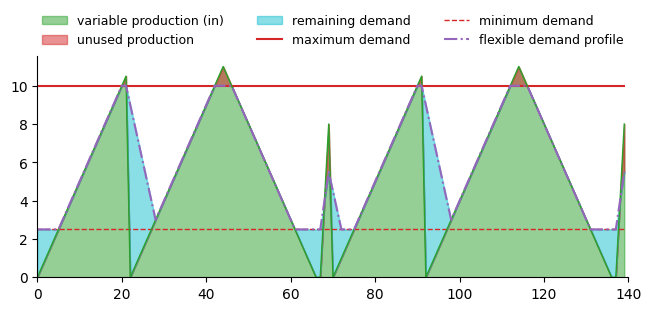

# Demand components

- [`GenericDemandComponent`](#demand-open-loop-converter-controller)
- [`FlexibleDemandComponent`](#flexible-demand-open-loop-converter-controller)

## Open-Loop Converter Controllers

Open-loop converter controllers define rule-based logic for meeting commodity demand profiles without using dynamic system feedback. These controllers operate independently at each timestep.

This page documents two core controller types:
1. Demand Open-Loop Converter Controller — meets a fixed demand profile.
2. Flexible Demand Open-Loop Converter Controller — adjusts demand up or down within flexible bounds.

(demand-open-loop-converter-controller)=
### Demand Open-Loop Converter Controller
The `GenericDemandComponent` allocates commodity input to meet a defined demand profile. It does not contain energy storage logic, only **instantaneous** matching of supply and demand.

The controller computes each value per timestep:
- Unmet demand (non-zero when supply < demand, otherwise 0.)
- Unused commodity (non-zero when supply > demand, otherwise 0.)
- Delivered output (commodity supplied to demand sink)

This provides a simple baseline for understanding supply–demand balance before adding complex controls.

#### Configuration
The controller is defined within the `tech_config` and requires these inputs.

| Field             | Type           | Description                           |
| ----------------- | -------------- | ------------------------------------- |
| `commodity_name`  | `str`          | Commodity name (e.g., `"hydrogen"`).  |
| `commodity_units` | `str`          | Units (e.g., `"kg/h"`).               |
| `demand_profile`  | scalar or list | Timeseries demand or constant demand. |

```yaml
control_strategy:
    model: GenericDemandComponent
model_inputs:
  control_parameters:
    commodity_name: hydrogen
    commodity_units: kg/h
    demand_profile: [10, 10, 12, 15, 14]
```
For an example of how to use the `GenericDemandComponent` open-loop control framework, see the following:
- `examples/23_solar_wind_ng_demand`

(flexible-demand-open-loop-converter-controller)=
### Flexible Demand Open-Loop Converter Controller
The `FlexibleDemandComponent` extends the fixed-demand controller by allowing the actual demand to flex up or down within defined bounds. This is useful for demand-side management scenarios where:
- Processes can defer demand (e.g., flexible industrial loads)
- The system requires demand elasticity without dynamic optimization

The controller computes:
- Flexible demand (clamped within allowable ranges)
- Unmet flexible demand
- Unused commodity
- Delivered output

Everything remains open-loop no storage, no intertemporal coupling.

For an example of how to use the `FlexibleDemandComponent` open-loop control framework, see the following:
- `examples/23_solar_wind_ng_demand`

The flexible demand component takes an input commodity production profile, the maximum demand profile, and various constraints (listed below), and creates a "flexible demand profile" that follows the original input commodity production profile while satisfying varying constraint.
Please see the figure below for an example of how the flexible demand profile can vary from the original demand profile based on the input commodity production profile and the ramp rates.
The axes are unlabeled to allow for generalization to any commodity and unit type.

|  |
|-|


#### Configuration
The flexible demand controller is defined within the `tech_config` with the following parameters:

| Field               | Type           | Description                                  |
| ------------------- | -------------- | -------------------------------------------- |
| `commodity_name`          | `str`          | Commodity name.                              |
| `commodity_units`         | `str`          | Units for all values.                        |
| `demand_profile`          | scalar or list | Default (nominal) demand profile.            |
| `turndown_ratio`          | float          | Minimum fraction of baseline demand allowed. |
| `ramp_down_rate_fraction` | float          | Maximum ramp-down rate per timestep expressed as a fraction of baseline demand. |
| `ramp_up_rate_fraction` | float          | Maximum ramp-up rate per timestep expressed as a fraction of baseline demand. |
| `min_utilization` | float          | Minimum total fraction of baseline demand that must be met over the entire simulation. |

```yaml
model_inputs:
  control_parameters:
    commodity_name: hydrogen
    commodity_units: kg/h
    demand_profile: [10, 12, 10, 8]
    turndown_ratio: 0.1
    ramp_down_rate_fraction: 0.5
    ramp_up_rate_fraction: 0.5
    min_utilization: 0
```
